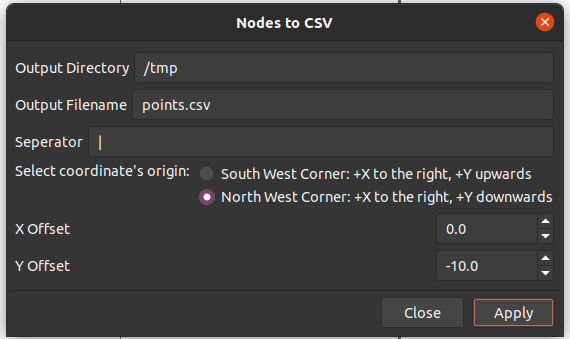
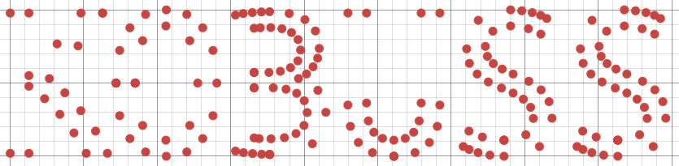

# Inkscape Extension to Output Path Nodes to CSV

Simple Inkscape extension to convert nodes of paths to x,y coordinates.

Features:
- X, Y offsets
- Configurable origin
- Configurable seperator - , | ","
- Output file



Insipration came from tekolay's [csv_output](https://github.com/tbekolay/csv_output) and jwcliff's [Inkscape_Exportxy](https://github.com/jwcliff/Inkscape_Exportxy)

## Convert Text to Points Example

1. Create your text
2. Convert text to paths (Path > Object to Path)
3. Select each path/letter
4. Select the "Edit path by nodes" tool
5. Export (Extensions > Export > Nodes to CSV...)
6. Plot or do other fun things!

```
-87.43034,509.56655,
-90.7739936,505.07739,
-94.6749225,500.61918,
-92.5696593,498.66872,
-90.4024766,496.2229,
-88.390093,493.43652,
-86.780185,490.40247,
```



## Installation

1. Copy `nodes_to_csv.inx` and `nodes_to_csv.py` to your Inkscape extensions folder. On Linux it is located at `~/.config/inkscape/extensions/`
2. Relaunch Inscape